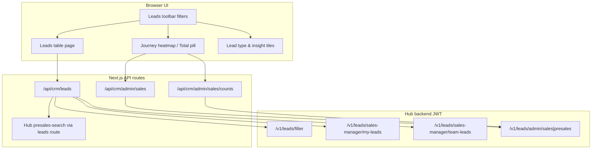

# CRM filters, hierarchy, and why totals differ per login

This document explains **how leads are fetched and counted today** in the New CRM frontend (`my-app`), how **filters** apply per role, and **why the same executive name can show 100 / 102 / 110** (or any other mismatch) when different people log in.

All numbers in examples are illustrative; the **mechanisms** are what matter.

---

## 1. Big picture

**Important:** The UI does **not** use one single “count query” for everything. **Table total**, **heatmap total**, **lead-type pills**, and **insight tiles** can each use **different code paths** and **different dedupe rules**, even when filters look the same.

---

## 2. Role hierarchy (who sees what)

| Role | Sales workspace pool | Typical API path | Client-side extra filtering |
|------|----------------------|----------------|-----------------------------|
| **SALES_EXECUTIVE** | Own assigned verified leads | `GET /api/crm/leads` → Hub `/v1/leads/filter` (JWT = only their rows) | `canViewLeadByRole` (self only) when `requiresClientScopedDataset` |
| **SALES_MANAGER** | Own + team verified leads | Same filter merge, or `roleView=my` / `team` / combined merge | `canViewLeadByRole` (self + team aliases); optional `narrowSalesManagerLeadsIfTeamKnown` patterns on heatmap |
| **SALES_ADMIN** | Org-wide sales assignee pool | `GET /api/crm/admin/sales` + `/counts` | Assignee scope + **phone primary-source dedupe** when hierarchy filter active |
| **SUPER_ADMIN / ADMIN** | Full admin sales + presales pools | Admin list + counts | Dual totals (all rows vs primary-source unique); SUPER_ADMIN search can merge pools |
| **PRESALES_EXECUTIVE** | Own presales inbox (unverified) | `presales-search` via `/api/crm/leads?leadPool=presales` | Hub JWT scope; client assignee filter **not** applied on presales exec (trust upstream) |
| **PRESALES_MANAGER** | Team presales inbox | Same presales-search | Team + self in `canViewLeadByRole` |

**JWT:** Hub always applies **server-side visibility** based on the logged-in user. The frontend **adds another layer** on top for several roles (`requiresClientScopedDataset`).

---

## 3. Filter dimensions (what can change the set)

These are sent as query params (BFF forwards many to Hub):

| Filter | Effect |
|--------|--------|
| **Workspace** | `sales` → verified sales milestones; `presales` → unverified + presales milestones |
| **verificationStatus** | Default: sales = `verified`, presales = `unverified` (admins often send empty = all in pool) |
| **leadType** | `all` merges 5 types (`formlead`, `glead`, `mlead`, `addlead`, `websitelead`) |
| **dateFrom / dateTo / crmMonthWindow** | Sales: usually **created** date; presales month: **assigned** timestamp when filtering |
| **assignee** (toolbar) | Passed to API; BFF also applies **substring** match on assignee name |
| **Hierarchy** (Sales Admin / Manager toolbar) | Resolves to `assignees[]` (manager + all exec names, or exec aliases) |
| **milestoneStage / Category / SubStage** | Sales vs presales field names; often re-applied **in the browser** after fetch |
| **reinquiry** | Forwarded to Hub |
| **search** | Client-side match in BFF `filterAndSortMergedLeads` (text + phone digits + JSON deep scan) |
| **roleView** (manager) | `my` → `/v1/leads/sales-manager/my-leads`; `team` → `team-leads`; `combined` → merge both |

Relevant code:

- BFF merge + filter: `app/api/crm/leads/route.ts` (`filterAndSortMergedLeads`, `mergeAll`)
- UI orchestration: `app/Components/CrmLeadData/LeadsDataSection.tsx` (`fetchMergedPage`, `fetchScopedMergedPage`)
- Admin pool: `lib/admin-leads-api.ts` (`fetchAdminLeadsHeatmapData`, `usesAdminLeadsApi`)

---

## 4. How a fetch works (by role)

### 4.1 SALES_EXECUTIVE (example: Total = 100)

1. UI calls `/api/crm/leads?mergeAll=1&verificationStatus=verified&...`
2. BFF loads **each lead type** from Hub `/v1/leads/filter` using **that user’s JWT**.
3. Hub returns **only rows that user is allowed to see** (typically assigned to them).
4. BFF **dedupes by lead `id`** across types, applies date/search/assignee/milestone filters, returns `totalElements = merged.length`.
5. UI may run `canViewLeadByRole` again → still “self only”.

**That 100 is:** “verified CRM leads, all types merged, after BFF filters, in JWT scope for this executive.”

### 4.2 SALES_MANAGER — filters by that executive’s name (example: 102)

Managers do **not** use the same JWT slice as the executive.

1. Still calls `/api/crm/leads` with `mergeAll=1`, often with `assignee=<exec display name>`.
2. Hub JWT returns **manager-visible rows** (wider than one exec).
3. BFF `assignee` filter uses **`assignee.toLowerCase().includes(query)`** (substring), not exact alias match.
4. UI then applies **`filterLeadsByAssigneeScope`** (exact normalized aliases) when hierarchy resolves exec scope.
5. If the manager’s team roster is loaded, **`canViewLeadByRole`** may still admit rows the exec JWT never saw (e.g. reassigned, alias mismatch, shared pool edge cases).
6. For **admin-style hierarchy filters** on sales workspace, counts may use **`pickPrimarySourceRows`** (one row per phone) → total can differ from raw row count.

**102 vs 100:** Often **+2** from (a) manager pool ⊃ exec pool, (b) substring vs exact assignee matching, (c) duplicate phones collapsed differently, or (d) extra pages fetched when `requiresFullyVisiblePage` loads 500/page across assignees.

### 4.3 SALES_ADMIN — same executive filter (example: 110)

Sales Admin uses a **different backend contract**:

1. List/counts: `/api/crm/admin/sales` and `/api/crm/admin/sales/counts` (Hub **assignee-role admin pool**).
2. This pool is **org-wide** (all assignee rows Hub stores for sales), not “what the executive’s JWT sees.”
3. Heatmap toolbar total prefers Hub **`totalElements` from counts**, then may align with **`pickPrimarySourceRows`** for milestone tiles.
4. With **Sales Manager / Exec / Admin** toolbar filters active, `salesHierarchyFilterActive` is true → table total uses **primary-source dedupe** (earliest `created_at` per phone).
5. Multi-assignee scope may **fetch once per name** and **`flat()` merge without deduping by id** for admin API (`usesAdminLeadsApi` branch).

**110 vs 100:** Admin pool can include **more rows per customer** (reinquiry, re-assignments, multiple lead types / ids same phone), **unverified handoff rows** if verification filter empty, and **rows the executive JWT excludes** but admin pool includes.

---

## 5. Where each “total” on screen comes from

| UI element | Typical source | Dedupe |
|------------|----------------|--------|
| **Total Leads pill** (table toolbar) | `visibleFilteredTotal` or `pageJson.totalElements` from `fetchScopedMergedPage` | Role-dependent; hierarchy admin → **primary phone** |
| **Heatmap “Total” / summary** (admin) | `fetchAdminLeadsHeatmapData` → `totalElements` + `uniquePrimaryTotal` | Heatmap cards: primary source; pill may show **all rows** |
| **Lead type pills** (External, Google, …) | `sourceCounts` from same `countBasis` as table OR separate `fetchAllScopedMergedLeads` effect | Can be primary or all rows |
| **Insight tiles** (follow-up, overdue, …) | `computeFollowUpInsightCounts` on **client-scoped** merged list | Same pool as tiles effect, not always same as table page |
| **Dashboard pipeline** | `CrmPipeline` fetches `mergeAll` leads + sub-status mappings | Counts substages on **loaded** leads (cap ~500/page × pages) |

So two users can both say “no filters” and still see different totals if one reads **heatmap admin counts** and the other reads **table JWT merge**.

---

## 6. `mergeAll` behavior (shared by exec/manager filter path)

When `mergeAll=1` (`LeadsDataSection` → `fetchMergedPage`):

1. Fetches **up to 5 lead types** in parallel from `/v1/leads/filter` (or manager endpoints).
2. **Dedupes by lead id** (first type wins).
3. Applies **client filters** in `filterAndSortMergedLeads` (search, assignee substring, dates, milestones).
4. Sets `totalElements = merged.length` (not Hub’s per-type total).

**Limits:** `maxPagesPerType` (100 sales / 200 presales) × `perType` page size (up to 500). If Hub has more rows, **counts are truncated** — another source of mismatch between roles that fetch different page sizes or admin full export.

---

## 7. Primary-source dedupe (why admin/hierarchy counts drop or shift)

`pickPrimarySourceRows` (`lib/primary-source-leads.ts`):

- Groups by **phone** (≥8 digits).
- Keeps **one** row per phone: earliest `created_at`.
- Used when **`salesHierarchyFilterActive`** for SALES_ADMIN (and related admin heatmap milestone counts).

**Effect:** Three API rows for one customer → executive might count **3** in a raw list view but admin hierarchy filter shows **1**. Conversely, admin pool might have a **different** earliest row (different assignee on older record) than the executive’s newest assigned row.

---

## 8. Assignee matching: two different algorithms

| Layer | Rule | Risk |
|-------|------|------|
| BFF `filterAndSortMergedLeads` | `assignee.includes(query)` | “Raj” matches “Rajesh”; partial names |
| UI `filterLeadsByAssigneeScope` | Exact normalized alias set from hierarchy user | Stricter; can **remove** rows BFF included |
| Hub `/v1/leads/filter` | Server-defined | Authoritative for JWT roles |

**Mismatch:** Manager passes `assignee=John Doe` → BFF returns 105 rows → client scope keeps 102 → executive JWT only had 100.

---

## 9. Your example scenario (100 / 102 / 110)

Assume **same executive “Exec A”**, same visible filters in the toolbar (dates, milestone, etc.).

| Login | Example total | What pool is really measured |
|-------|---------------|------------------------------|
| **SALES_EXECUTIVE (Exec A)** | **100** | Hub JWT: rows assigned to Exec A, verified, after mergeAll + BFF filters |
| **SALES_MANAGER** (filter Exec A) | **102** | Manager JWT pool + assignee/hierarchy filters + possible extra team-visible rows; may differ on substring/alias; may not use primary dedupe on table |
| **SALES_ADMIN** (filter Exec A) | **110** | Admin assignee pool (org-wide), often **more rows per phone**; primary-source dedupe still leaves more **unique customers** than exec sees; counts API + list merge |

### Root causes (ordered by impact)

1. **Different upstream APIs** — JWT filter vs admin assignee pool (not the same dataset).
2. **Different visibility rules** — JWT scope vs `canViewLeadByRole` vs admin pool.
3. **Primary-source vs raw row counts** — admin hierarchy uses phone dedupe; exec total often does not.
4. **Multi-row customers** — reinquiry / multiple lead ids; admin pool exposes all; exec sees subset.
5. **Assignee matching** — substring (BFF) vs exact aliases (UI) vs Hub assignee fields (`assignee` vs `salesOwner`).
6. **Pagination caps** — incomplete merge when Hub has more pages than fetched.
7. **Split brain: heatmap vs table** — admin heatmap uses `/counts` + full list; table uses `fetchScopedMergedPage` with different `countBasis`.
8. **verificationStatus defaults** — exec sales inbox defaults **verified**; admin may send **empty** (wider pool) unless toolbar forces verified.

**Yes, data ultimately comes from the backend** — but through **different Hub endpoints**, then **BFF merge/filter**, then **browser scoping/dedupe**. Totals are **not guaranteed** to match across roles until those layers use the **same pool definition**.

---

## 10. Presales (short)

| Topic | Behavior |
|-------|----------|
| Pool | `presales-search` (JWT-scoped inbox) |
| Default verification | `unverified` |
| Exec client assignee filter | Disabled (`trustPresalesUpstreamLeadScope`) — trust Hub |
| Admin presales | `/api/crm/admin/presales` — separate pool; doc comment: not comparable to exec month inbox |
| Month window | Uses **assigned** timestamp, not created |

Same mismatch pattern: **presales exec JWT** vs **admin presales pool** vs **heatmap client filter**.

---

## 11. File map (for engineers)

| Area | File |
|------|------|
| BFF leads merge/filter | `app/api/crm/leads/route.ts` |
| Leads page fetch + totals | `app/Components/CrmLeadData/LeadsDataSection.tsx` |
| Admin pool + heatmap counts | `lib/admin-leads-api.ts` |
| Phone dedupe | `lib/primary-source-leads.ts` |
| Assignee scope | `lib/admin-assignee-match.ts` |
| Manager team narrowing | `lib/sales-manager-lead-scope.ts` |
| Workspace / verification defaults | `lib/crm-workspace.ts` |
| Dashboard pipeline counts | `app/Components/CrmDashboard/CrmPipeline.tsx` |
| Toolbar hierarchy → assignees | `app/Components/CrmDashboard/LeadFilters.tsx` |

---

## 12. What “correct” would mean (product / engineering)

To make **Exec A = Manager filter = Admin filter** (when intended):

1. **One canonical pool per question** — e.g. “assigned verified CRM rows for alias set X” — defined in Hub, not reimplemented in BFF/UI.
2. **One canonical customer key** — always count by phone primary source **or** always by lead id; document which.
3. **Same assignee matching everywhere** — exact alias list end-to-end; remove substring `.includes` for hierarchy filters.
4. **Same API for table and heatmap** — admin should not mix `/counts` total with a differently filtered table page.
5. **Align JWT exec view with admin slice** — either admin filter calls a Hub “as exec” endpoint, or exec view uses the same assignee-pool row definition.

Until then, **different logins reporting different totals for the “same” filter is expected behavior of the current architecture**, not necessarily a single backend bug.

---

## 13. Quick debugging checklist

When reports disagree:

1. Note **role**, **workspace** (sales/presales), and **exact toolbar filters**.
2. Compare Network tab: `/api/crm/leads` vs `/api/crm/admin/sales` vs `/counts`.
3. Check `mergeAll`, `verificationStatus`, `assignee`, `roleView`, `leadPool`.
4. Compare `totalElements` in JSON vs visible rows (client milestone filter after fetch?).
5. Ask if Total pill uses **heatmap** (`visibleFilteredTotal` from admin) or **table page** meta.
6. For admin hierarchy filter, check whether total is **primary-source** (`pickPrimarySourceRows`) or raw.
7. Confirm pagination: response `totalPages` × `size` — was full pool loaded?

---

*Generated from frontend code paths in CrmInceneration `my-app` (Leads list, BFF, admin pool). Hub backend rules inside `/v1/leads/*` may add further differences not visible in this repo.*
