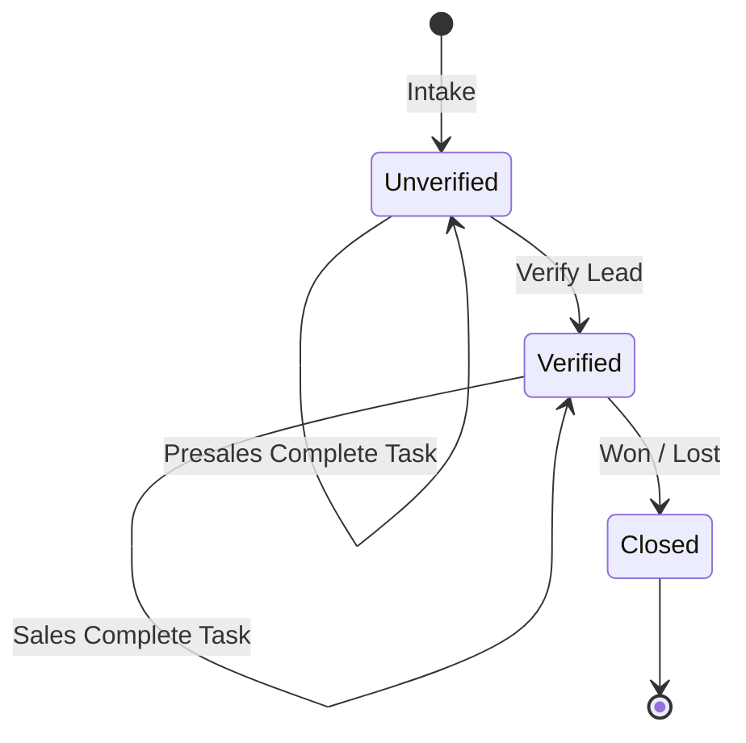
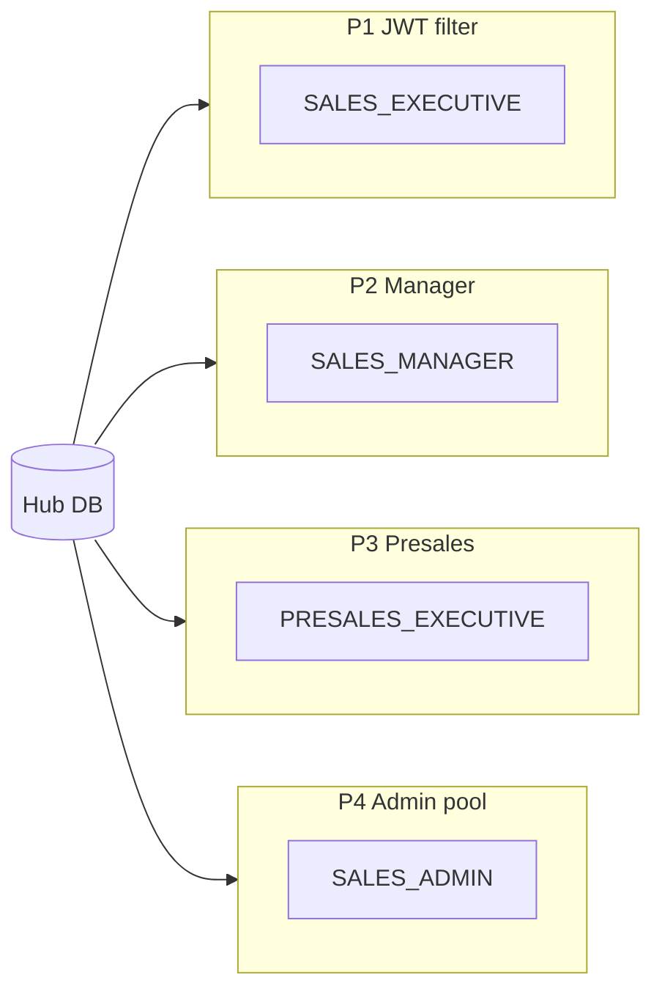
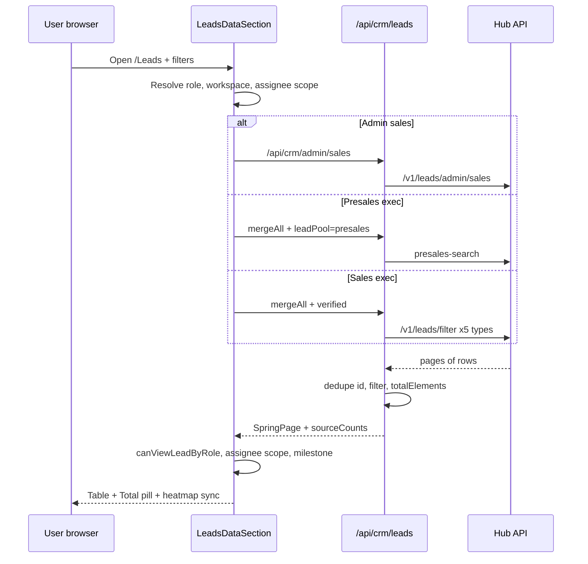

# CRM full system flow — verified/unverified leads, fetching, filtering, and counting

**Audience:** Engineers, product, and AI assistants working on CrmInceneration (`my-app`).  
**Goal:** One place to understand **how the whole CRM works**, how leads are **segregated**, **fetched**, and **counted**, and why **totals disagree** across logins — so you can pick the right fix.

**Related docs:**

| Doc | Focus |
|-----|--------|
| [PROJECT_GUIDE.md](./PROJECT_GUIDE.md) | Day-to-day CRM features, roles, APIs |
| [CRM_FILTERS_AND_COUNT_MISMATCH.md](./CRM_FILTERS_AND_COUNT_MISMATCH.md) | Deep dive on count mismatch (100 / 102 / 110 example) |
| [ADMIN_LEADS_FRONTEND_INTEGRATION.md](./ADMIN_LEADS_FRONTEND_INTEGRATION.md) | Admin pool + hybrid counts |
| [NEW_CRM_SALES_PRESALES_BACKEND_HANDOFF.md](./NEW_CRM_SALES_PRESALES_BACKEND_HANDOFF.md) | Hub contract notes |

---

## Table of contents

1. [Mental model in 60 seconds](#1-mental-model-in-60-seconds)
2. [Architecture layers](#2-architecture-layers)
3. [What is a “lead” in this system](#3-what-is-a-lead-in-this-system)
4. [Verified vs unverified — the main segregation](#4-verified-vs-unverified--the-main-segregation)
5. [Two pipelines, two milestone tracks](#5-two-pipelines-two-milestone-tracks)
6. [End-to-end lifecycle](#6-end-to-end-lifecycle)
7. [Workspaces: sales vs presales](#7-workspaces-sales-vs-presales)
8. [Role hierarchy and visibility](#8-role-hierarchy-and-visibility)
9. [Data pools — where rows actually come from](#9-data-pools--where-rows-actually-come-from)
10. [Fetch flow (step by step)](#10-fetch-flow-step-by-step)
11. [Filter pipeline (all layers)](#11-filter-pipeline-all-layers)
12. [Counting — every number on screen](#12-counting--every-number-on-screen)
13. [Creating and importing leads](#13-creating-and-importing-leads)
14. [Assignment, verify, and handoff](#14-assignment-verify-and-handoff)
15. [Complete Task and milestone updates](#15-complete-task-and-milestone-updates)
16. [Dashboard vs Leads page](#16-dashboard-vs-leads-page)
17. [Count mismatch problem — root cause map](#17-count-mismatch-problem--root-cause-map)
18. [Directions for a “single truth” fix](#18-directions-for-a-single-truth-fix)
19. [File index](#19-file-index)

---

## 1. Mental model in 60 seconds

1. **Leads enter** from forms, ads, website, manual create, or Excel import → stored on **Hub** (backend).
2. New rows start in **presales** as **unverified** — presales qualifies them (`presalesMilestone*`).
3. **Verify Lead** flips `verified=true`, assigns a **sales executive**, sets presales to **Data Conversion / Won / Assigned**.
4. The same customer then lives in the **sales** workspace as **verified** — sales progresses `milestoneStage` → **Closed**.
5. The **browser never talks to Hub directly** for CRM lists; it calls **Next.js BFF** (`/api/crm/*`), which forwards the user’s **JWT**.
6. **Different roles** call **different Hub endpoints** and apply **different client filters/dedupes** → **totals are not one global number**.



---

## 2. Architecture layers

```
┌─────────────────────────────────────────────────────────────────┐
│  React UI (app/Components, app/Leads, app/page.tsx)              │
│  - LeadsDataSection, JourneyPhaseHeatmap, CrmPipeline, modals    │
└────────────────────────────┬────────────────────────────────────┘
                             │ fetch("/api/crm/...") + Bearer token
                             ▼
┌─────────────────────────────────────────────────────────────────┐
│  Next.js BFF (app/api/crm/*)                                   │
│  - Merge 5 lead types, client filters, dedupe, pagination      │
│  - resolveViewerRole via /api/auth/me                            │
└────────────────────────────┬────────────────────────────────────┘
                             │ Authorization: Bearer <crm_token>
                             ▼
┌─────────────────────────────────────────────────────────────────┐
│  Hub API (BASE_URL, e.g. hows.hubinterior.com)                 │
│  /v1/leads/filter, presales-search, admin/sales, verify, …      │
│  JWT enforces row-level visibility per user/role                 │
└─────────────────────────────────────────────────────────────────┘
```

| Layer | Responsibility |
|-------|----------------|
| **UI** | Toolbar filters, role-based visibility, heatmap, table pagination, insight tiles |
| **BFF** | Same-origin proxy, `mergeAll`, assignee substring filter, date/milestone filters, `sourceCounts` |
| **Hub** | Source of truth for rows, verification, assignment, milestones |

**Auth:** `localStorage` keys `crm_token`, `crm_role`, `crm_user_name` → `getCrmAuthHeaders()` on every CRM request.

---

## 3. What is a “lead” in this system

### 3.1 Lead types (sources)

Five types are merged in the inbox (`mergeAll=1`):

| `leadType` | Typical intake | Hub path pattern |
|------------|----------------|------------------|
| `formlead` | External form | `/v1/FormLead/...` |
| `glead` | Google Ads | `/v1/GLead/...` |
| `mlead` | Meta Ads | `/v1/MLead/...` |
| `addlead` | Manual add | `/v1/AddLead` |
| `websitelead` | Website | `/v1/WebsiteLead/...` |

Detail URL: `/Leads/{leadType}/{id}`

### 3.2 One customer, many rows

The same person can appear as:

- Multiple **lead types** (reinquiry / additional sources → `additionalLeadSources`)
- Multiple **rows** in the **admin pool** (assignee-role table on Hub)
- One **primary** row per phone when UI uses `pickPrimarySourceRows` (earliest `created_at` wins)

So “lead count” can mean **rows**, **unique phones**, or **JWT-visible rows** — never assume one definition.

### 3.3 Core API shape (`ApiLead`)

Important fields (`lib/leads-filter.ts`):

| Field | Meaning |
|-------|---------|
| `id` | Row id (dedupe key in `mergeAll`) |
| `leadType` | Source bucket |
| `verified` / `verificationStatus` | Handoff to sales |
| `assignee`, `salesOwner` | Who owns the row (string or object) |
| `presalesMilestoneStage/Category/SubStage` | Presales pipeline |
| `stage.milestoneStage/Category/SubStage` | Sales pipeline |
| `followUpDate`, `updatedAt`, `createdAt` | Scheduling & sorting |
| `presalesTrackingReadOnly` | Verified row presales can still open read-only |

---

## 4. Verified vs unverified — the main segregation

This is the **primary business split** in the New CRM.

### 4.1 Definitions

| State | Meaning | Default workspace |
|-------|---------|-----------------|
| **Unverified** | In presales pool; not handed to sales | Presales (`/presales-leads`, unverified filters) |
| **Verified** | Handed off; sales owns milestone progression | Sales (`/Leads`, `verificationStatus=verified`) |

**Detection** (`isCrmLeadVerified` in `lib/leads-filter.ts`):

- Reads `verificationStatus`, `verified`, and related boolean/string flags from root + `dynamicFields`.
- Normalizes to `verified` | `unverified` for tags and filters.

### 4.2 Default filter per workspace

`defaultLeadsVerificationStatus` (`lib/crm-workspace.ts`):

| Viewer | Sales workspace | Presales workspace |
|--------|-----------------|---------------------|
| Exec / Manager | `verified` | `unverified` (or explicit tab) |
| Admin / Super Admin / Sales Admin | often **empty** (whole pool) | often **empty** or tab-driven |

### 4.3 What changes on verify

`POST /api/crm/lead/{leadType}/{id}/verify` → Hub verify endpoint.

After success (frontend expectation):

- `verified = true`
- Presales milestone → **Data Conversion / Won / Assigned**
- Sales assignee set (pincode + optional `salesExecutiveId`)
- Presales UI becomes **read-only** (`isPresalesHandedOffReadOnly`)

### 4.4 Presales exec visibility nuance

`shouldPresalesExecutiveSeeLeadInCrmPool` (`lib/presales-lead-visibility.ts`):

- Self-assigned rows
- API flag `presalesTrackingReadOnly`
- **Any verified row Hub returned in their JWT** (so “Total” tab can include handoff rows)

Presales exec inbox **trusts Hub JWT** for assignee — client does not re-filter assignee names on presales-search (`trustPresalesUpstreamLeadScope`).

---

## 5. Two pipelines, two milestone tracks

| Track | Fields | Stages (top level) |
|-------|--------|-------------------|
| **Presales** | `presalesMilestoneStage`, `presalesMilestoneCategory`, `presalesMilestoneSubStage` | Fresh Data → Data Discovery → Data Conversion |
| **Sales** | `stage.milestoneStage`, `milestoneStageCategory`, `milestoneSubStage` | Fresh Lead → Discovery → Connection → Experience & Design → Decision → Closed |

Pipeline catalog from Hub:

`GET /api/crm/crm-pipeline?nested=true&role=PRESALES_EXECUTIVE|SALES_EXECUTIVE`

Complete Task modal loads allowed substages from this tree (`lib/complete-task-pipeline.ts`).

**Admin / dual view:** On unverified presales detail, ADMIN can see **both** pipelines (`canViewBothMilestonePipelines`).

---

## 6. End-to-end lifecycle

```
INTAKE (Hub creates row, usually unverified, presales assignee)
    │
    ▼
PRESALES POOL ─────────────────────────────────────────────┐
│  Filters: verificationStatus=unverified                 │
│  API: presales-search OR filter + leadPool=presales     │
│  Actions: Presales Complete Task, notes, calls            │
│  Stages: Fresh Data → Data Discovery → Data Conversion  │
└───────────────────────────────┬───────────────────────────┘
                                │ Verify Lead (POST verify)
                                ▼
SALES POOL ────────────────────────────────────────────────┐
│  Filters: verificationStatus=verified (default)           │
│  API: /v1/leads/filter (JWT scoped) or admin/sales        │
│  Actions: Sales Complete Task, appointments, Design QA    │
│  Stages: Fresh Lead → … → Closed (Won/Lost)               │
└───────────────────────────────┬───────────────────────────┘
                                │
                    ┌───────────┴───────────┐
                    ▼                       ▼
              LOST (+ reason)          WON → Token / Booking
                                              │
                                              ▼
                                    Sales Closure (external app)
```

**Reinquiry:** `additionalLeadSources` populated → filter `reinquiry=true|false`.

**Rollback:** `POST .../stage-rollback` (super admin / when Hub allows).

---

## 7. Workspaces: sales vs presales

`CrmWorkspace` = `"sales" | "presales"` (`lib/crm-workspace.ts`).

| Aspect | Sales | Presales |
|--------|-------|----------|
| Routes | `/Leads`, `/` dashboard | `/presales-leads`, `/presales-dashboard` |
| Default verification | `verified` | `unverified` |
| Milestone query keys | `milestoneStage`, `milestoneStageCategory`, `milestoneSubStage` | `presalesMilestone*` |
| List stage column | `crmLeadTopLevelStage` | `presalesTopLevelStage` |
| Primary pool API | `/v1/leads/filter` or admin sales | `presales-search` or admin presales |
| Date filter (month) | Usually **created** date | Often **assigned** timestamp |

`workspaceFromPathname(pathname)` picks workspace from URL.

---

## 8. Role hierarchy and visibility

### 8.1 Roles (normalized)

| Role | Landing | Primary data pool |
|------|---------|-------------------|
| `SUPER_ADMIN` | `/super-admin` | Admin sales + presales + global search |
| `ADMIN` | `/admin` | Admin pools, dual pipeline on detail |
| `SALES_ADMIN` | `/admin` | **Admin sales pool** (org-wide assignee rows) |
| `SALES_MANAGER` | `/sales-manager` | JWT filter + **client** team scope |
| `SALES_EXECUTIVE` | `/Leads` | JWT filter (**own** rows only) |
| `PRESALES_MANAGER` | `/Leads` | presales-search + team |
| `PRESALES_EXECUTIVE` | `/Leads` | presales-search (JWT) |
| `PRE_SALES` | alias → `PRESALES_EXECUTIVE` | same |

### 8.2 Client visibility (`canViewLeadByRole`)

Used when `requiresClientScopedDataset` is true (`LeadsDataSection.tsx`):

| Role | Sees row if |
|------|-------------|
| `SALES_EXECUTIVE` | Assignee aliases match **self** |
| `SALES_MANAGER` | Self or assignee in **team roster** (+ hierarchy aliases) |
| `PRESALES_EXECUTIVE` | `shouldPresalesExecutiveSeeLeadInCrmPool` |
| `PRESALES_MANAGER` | Self or presales team names |
| Admin roles | Always (for client filter pass-through) |

This runs **after** Hub returns data — can only **remove** rows, not add rows Hub hid.

### 8.3 Toolbar hierarchy → assignee scope

`LeadFilters.tsx` builds `assignee` or `assignees[]`:

- Pick **Sales Exec** → that user’s display name + alias list
- Pick **Sales Manager** → manager name + all visible exec names
- Pick **Sales Admin** → all execs under selected admin’s managers

`LeadsDataSection` resolves `activeAssigneeScope` and may:

- Fetch **once per assignee** and merge (admin: **no** id dedupe)
- Apply `filterLeadsByAssigneeScope` (exact normalized alias match)

---

## 9. Data pools — where rows actually come from

Think of **four different “pools”** — mixing them causes count mismatch.

| Pool ID | Hub endpoint | Who uses it | Scope |
|---------|--------------|-------------|--------|
| **P1 – JWT filter** | `GET /v1/leads/filter?milestoneScope=crm` | Sales exec, manager (default), BFF `mergeAll` | Whatever Hub allows for **this JWT** |
| **P2 – Manager split** | `/v1/leads/sales-manager/my-leads` or `team-leads` | Manager `roleView=my|team|combined` | Manager’s my vs team |
| **P3 – Presales inbox** | `/v1/leads/presales-search` | Presales roles, `leadPool=presales` | Presales JWT scope |
| **P4 – Admin assignee pool** | `/v1/leads/admin/sales` or `presales` + `/counts` | SALES_ADMIN, SUPER_ADMIN, ADMIN heatmap | **Org-wide** assignee-role rows |



**Critical:** Filtering toolbar “Exec A” on **P1** vs **P4** is **not** the same query — exec sees JWT slice; admin sees org assignee table.

---

## 10. Fetch flow (step by step)

### 10.1 Leads page main loader

Entry: `LeadsDataSection.load()` → `fetchScopedMergedPage()` → `fetchMergedPage()` (`LeadsDataSection.tsx`).

**Decision tree:**

```
fetchMergedPage
├── SALES_MANAGER + leadView=combined?
│   └── Merge my-leads + team-leads pages (dedupe by id)
├── usesAdminLeadsApi(role) && not roleView?
│   └── fetchAdminLeadsPage → /api/crm/admin/{sales|presales}
├── SUPER_ADMIN + search?
│   └── fetchAllAdminLeads both workspaces, dedupe, pool totals
└── else
    └── GET /api/crm/leads?mergeAll=0|1&...
```

### 10.2 BFF `GET /api/crm/leads` (`app/api/crm/leads/route.ts`)

| Query | Behavior |
|-------|----------|
| `mergeAll=0` | Single lead type, passthrough to Hub filter (or manager endpoint) |
| `mergeAll=1` | Fetch each allowed type, **dedupe by id**, `filterAndSortMergedLeads`, return `totalElements = merged.length` |
| `roleView=my\|team` | Manager-specific Hub URL |
| `leadPool=presales` | `fetchPresalesSearchLeads` instead of filter merge |
| `newCrmGlobalSearch=true` | Broader search mode for listed roles |

**Post-merge filters (BFF):** search (text/phone/deep JSON), assignee **substring**, date range, milestone match, sort by `updatedAt`.

**Limits:** Up to `maxPagesPerType` pages × `perType` size — very large pools may be **truncated**.

### 10.3 Admin heatmap loader

For `SALES_ADMIN` / `SUPER_ADMIN` (no manager roleView):

`fetchAdminLeadsHeatmapData` (`lib/admin-leads-api.ts`):

1. Try Hub `/v1/leads/admin/{workspace}/counts`
2. Paginate full `/admin/{workspace}` list
3. Build **dual counts**: all rows vs **primary-source unique** (phone dedupe)
4. Milestone heatmap buckets from **primary** rows

When **sales hierarchy toolbar** filter active → heatmap uses `fetchAllScopedMergedLeads` + `pickPrimarySourceRows` instead (aligned with table scoping path).

### 10.4 Assignee multi-fetch

If `activeAssigneeScope.length > 1`:

- Fetch all pages per assignee name
- Admin: `chunks.flat()` (**duplicates allowed**)
- Non-admin: `dedupeAdminPoolLeads` by id

---

## 11. Filter pipeline (all layers)

Filters apply in **sequence** — changing order or definition changes counts.

| Step | Where | What |
|------|-------|------|
| 1 | Hub | JWT role, server-side query params (`verificationStatus`, dates, etc.) |
| 2 | BFF `filterAndSortMergedLeads` | Search, assignee `.includes()`, dates, milestones |
| 3 | UI `canViewLeadByRole` | Role-based row drop |
| 4 | UI `filterLeadsByAssigneeScope` | Exact alias set from hierarchy |
| 5 | UI `leadMatchesWorkspaceMilestoneFilter` | Milestone toolbar (sometimes **after** pagination) |
| 6 | UI `pickPrimarySourceRows` | Phone dedupe (admin hierarchy counts) |
| 7 | UI `filterLeadsForInsightMode` | Follow-up / overdue insight table |

**Assignee mismatch:** Step 2 uses **substring**; step 4 uses **exact aliases** → manager/admin can get different sets than BFF alone.

**Milestone mismatch:** BFF may filter milestones; UI **again** filters table rows when toolbar milestone set — table can show fewer rows than `totalElements` if meta counted pre-milestone.

---

## 12. Counting — every number on screen

| UI label | Typical computation | Dedupe / pool |
|----------|---------------------|---------------|
| **Total Leads** (toolbar pill) | `visibleFilteredTotal` or `pageJson.totalElements` | From active fetch path; hierarchy admin → primary phone |
| **Total Leads** (admin dual) | `leadTypeCountsPrimary` vs `leadTypeCountsAllRows` | Primary unique vs raw rows (SUPER_ADMIN) |
| **Lead type pills** | `sourceCounts` from `countBasis` rows | Same as table basis when aligned |
| **Heatmap phase counts** | `milestoneCountsFromLeads` on scoped pool | Admin: primary rows; exec: loaded pool |
| **Journey summary** (Lead / Opportunity) | `computeJourneySummaryCounts` | By sales top-level stage |
| **Insight tiles** (follow-up, overdue, …) | `computeFollowUpInsightCounts` on `fetchAllScopedMergedLeads` | Separate effect — may lag table filters |
| **Manager mine / team** | `countSalesManagerMineVsTeam` | Subset of scoped pool |
| **Dashboard CrmPipeline** | Count leads per stage in loaded set | `mergeAll` + `verificationStatus` by workspace; capped pages |
| **Presales month cards** | `presalesSummaryMetricsFromLeads` | Current month assigned pool |

### 12.1 Primary-source dedupe (phone)

`pickPrimarySourceRows` (`lib/primary-source-leads.ts`):

- Group by phone (≥8 digits)
- Keep row with earliest `created_at`
- Used for **admin hierarchy filtered totals** and heatmap milestone cards

**Why it matters:** 3 API rows, 1 phone → exec might count 3 in one view, admin hierarchy counts **1**.

### 12.2 mergeAll dedupe (id)

Across 5 lead types, same `id` kept once → `totalElements = merged.length`.

Different from phone dedupe — same customer with **different ids** across types counts as **multiple** in mergeAll.

---

## 13. Creating and importing leads

| Path | Entry | Result |
|------|-------|--------|
| **Manual create** | `/create-lead` → `POST {BASE_URL}/v1/AddLead` | New row; may self-assign creator |
| **Excel import** | `/import-leads` | Bulk create on Hub |
| **External intake** | Forms / ads / website | Hub creates typed lead |
| **Detail external-intake** | `postExternalIntakeLead` on schedule/meeting | Syncs meeting to external systems |

After create: `crm:leads-invalidate` event refreshes lists.

New rows typically:

- `verified = false`
- Presales assignee
- Enter **P3** presales pool

---

## 14. Assignment, verify, and handoff

### 14.1 Assignment

`POST /api/assignment/assign` (`lib/assignment-reassign.ts`):

- Changes assignee on Hub
- Cross-pool moves (e.g. verified sales → presales) may require **`reassignReason`**
- Backend may reset milestones / verification

### 14.2 Verify (presales → sales)

```
UI: Verify lead footer OR Complete Task → Assigned
  → POST /api/crm/lead/{type}/{id}/verify
    → Hub verify
  → UI sets verified + presales Won/Assigned locally
  → reload detail + activities
```

Guards: `canVerifyCurrentLead` (exec self-assign, manager team, super admin).

Cannot set Won/Assigned via presales PUT on unverified (`PRESALES_VERIFY_LEAD_REQUIRED_MESSAGE`).

### 14.3 Handoff read-only

`isPresalesHandedOffReadOnly` / `isLeadHandedOffToSales`:

- Presales roles lose edit on verified handoff
- Sales workspace owns updates

---

## 15. Complete Task and milestone updates

| Mode | API | Fields |
|------|-----|--------|
| Presales | `PUT /api/crm/lead/{type}/{id}` | `presalesMilestone*` in body / `stage` |
| Sales | Same PUT | `milestoneStage`, category, substage |

Modal loads pipeline via `fetchCrmPipeline` + `resolveCompleteTaskMappings`.

**Gates:**

- Connection: budget, property notes, configuration (`milestone-advance-gates.ts`)
- LOST: `resone` required
- Booking Done: sales closure external flow

---

## 16. Dashboard vs Leads page

| Page | Components | Fetch |
|------|------------|-------|
| `/` sales dashboard | `AnalyticsBar`, `CrmPipeline`, `LeadFilters` | `mergeAll` leads + pipeline nested; verification **verified** |
| `/presales-dashboard` | Same pattern | verification **unverified** |
| `/Leads` | `LeadsDataSection` + heatmap + table | Full scoping per role (sections above) |

Dashboard **Won/Lost path** counts substages on **loaded** leads (not a separate Hub count API) — can diverge from Leads table if filters differ.

---

## 17. Count mismatch problem — root cause map

Your example:

| Login | Filter | Example total |
|-------|--------|---------------|
| SALES_EXECUTIVE | (none, own JWT) | 100 |
| SALES_MANAGER | Exec A | 102 |
| SALES_ADMIN | Exec A | 110 |

### 17.1 Is data “from backend only”?

**Yes and no.** All rows originate on Hub, but the frontend:

1. Calls **different Hub endpoints** (P1 vs P4)
2. Applies **BFF filters** not mirrored on other roles
3. Applies **client filters** (`canViewLeadByRole`, assignee scope, milestones)
4. Uses **different dedupe** (id merge vs phone primary vs none)

So each login computes a **different derived total** on top of backend data.

### 17.2 Root cause checklist

| # | Cause | Symptom |
|---|--------|---------|
| R1 | **Pool mismatch** (JWT vs admin) | Admin > exec for “same” exec filter |
| R2 | **JWT scope ⊃ exec** when manager filters | Manager sees 102, exec 100 |
| R3 | **Primary-source dedupe** only on admin/hierarchy | Admin unique customers ≠ exec rows |
| R4 | **Multi-row per phone** in admin pool | Admin 110, exec 100 |
| R5 | **assignee `.includes()` vs exact alias** | Off-by-few between BFF and UI |
| R6 | **Table vs heatmap code paths** | Pill ≠ heatmap with “no filters” |
| R7 | **Pagination cap** on mergeAll | Under-count vs Hub truth |
| R8 | **verificationStatus default** empty for admin | Admin includes unverified in pool |
| R9 | **Insight/tiles separate fetch** | Tiles ≠ Total Leads |
| R10 | **Milestone filter applied twice** | `totalElements` vs visible rows differ |

Full narrative: [CRM_FILTERS_AND_COUNT_MISMATCH.md](./CRM_FILTERS_AND_COUNT_MISMATCH.md).

---

## 18. Directions for a “single truth” fix

Use this doc to choose **one definition** per product question, then align code.

| Product question | Pick one definition | Align |
|------------------|---------------------|--------|
| “How many leads does Exec A have?” | All assignee-role rows vs JWT-visible vs unique phones | Hub endpoint + document in UI |
| “Total Leads pill” | Same `countBasis` as table always | One function, one dedupe |
| “Manager filtering exec” | Slice of **same pool** exec would see + team rules | Hub “view as” or shared filter API |
| “Admin reporting” | Explicit **unique customers** vs **assignee rows** | Label UI: “110 rows (98 customers)” |
| Assignee filter | Exact alias list end-to-end | Remove BFF substring for hierarchy |
| Heatmap vs table | Same `fetchAdminLeadsHeatmapData` input as `fetchScopedMergedPage` | Single query builder |

**Minimal frontend alignment (no Hub change):**

1. `buildLeadsQueryParams(role, filters)` — one module used by table, heatmap, tiles.
2. Always use `filterLeadsByAssigneeScope` rules in BFF for assignee (or stop BFF assignee filter).
3. Show **both** totals for admin: `uniquePrimaryTotal` + `totalElements` with labels.

**Proper fix (with Hub):**

1. Hub exposes `GET /v1/leads/counts?assigneeId=&verified=&scope=exec|admin` returning `{ rows, uniqueCustomers }`.
2. All roles call it for pills; list fetch separate and consistent.

---

## 19. File index

| Topic | File |
|-------|------|
| BFF leads merge | `app/api/crm/leads/route.ts` |
| Leads page orchestration | `app/Components/CrmLeadData/LeadsDataSection.tsx` |
| Admin pool + heatmap | `lib/admin-leads-api.ts` |
| Verification helpers | `lib/leads-filter.ts` |
| Workspace defaults | `lib/crm-workspace.ts` |
| Presales visibility | `lib/presales-lead-visibility.ts` |
| Phone dedupe | `lib/primary-source-leads.ts` |
| Assignee match | `lib/admin-assignee-match.ts` |
| Manager scope | `lib/sales-manager-lead-scope.ts` |
| Presales milestones | `lib/presales-milestone.ts` |
| Complete Task mapping | `lib/complete-task-pipeline.ts` |
| Pipeline fetch | `lib/crm-pipeline.ts` |
| Verify proxy | `app/api/crm/lead/[leadType]/[id]/verify/route.ts` |
| Dashboard pipeline | `app/Components/CrmDashboard/CrmPipeline.tsx` |
| Heatmap | `app/Components/CrmLeadData/JourneyPhaseHeatmap.tsx` |
| Toolbar hierarchy | `app/Components/CrmDashboard/LeadFilters.tsx` |
| Lead detail + verify | `app/Components/CrmLeadDetails/LeadDetailsApiClient.tsx` |

---

## Quick reference diagram (full fetch for Leads table)



---

*This document describes the CrmInceneration frontend as implemented in `my-app`. Hub behavior inside `/v1/*` may add rules not visible in this repository — treat Hub OpenAPI / handoff docs as authoritative for server-side filters.*
