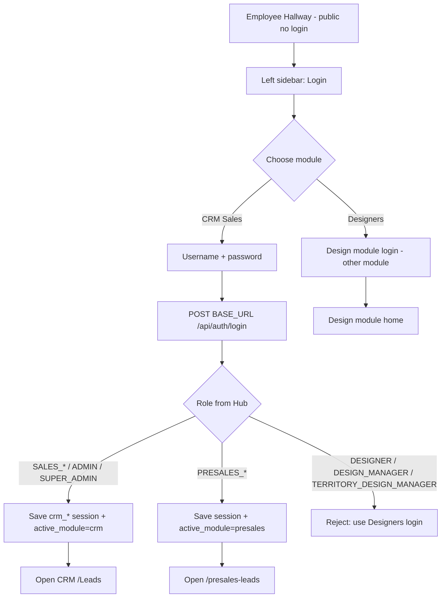

# Employee Hallway → Login → CRM Sales / Designers

**Audience:** Antigravity AI (implementation handoff)  
**Repo:** `CrmInceneration/my-app` (CRM Next.js app)  
**Status:** Spec for new UX (hallway + pre-login module choice). Today the app goes straight to `/login` then role-based landing — there is **no** public hallway yet.

---

## Goal (plain language)

1. Build a public **Employee Hallway** page anyone can open **without login**.
2. Left sidebar has a **Login** entry.
3. Login opens with **two choices**:
   - **CRM Sales** — Hub CRM auth; sales / sales manager / CRM admin roles only.
   - **Designers** — separate Design module auth/entry (not CRM designer roles via CRM login path).
4. If user picks **CRM Sales** and credentials belong to a CRM sales role → call **CRM / Hub auth API** → land **directly inside CRM module**.

---

## High-level flow

```text
┌─────────────────────────────────────────────────────────────┐
│  EMPLOYEE HALLWAY (public, no auth)                         │
│  Anyone can browse hallway content                          │
│                                                             │
│  ┌──────────────┐                                           │
│  │ Left sidebar │  →  [ Login ]                             │
│  └──────────────┘                                           │
└───────────────────────────┬─────────────────────────────────┘
                            │ click Login
                            ▼
┌─────────────────────────────────────────────────────────────┐
│  LOGIN PAGE — MODULE CHOICE                                 │
│                                                             │
│     ┌─────────────────┐      ┌─────────────────┐            │
│     │  CRM Sales      │      │  Designers      │            │
│     │  (this CRM app) │      │  (other module) │            │
│     └────────┬────────┘      └────────┬────────┘            │
└──────────────┼─────────────────────────┼────────────────────┘
               │                         │
               ▼                         ▼
     Username + password          Design module login
     → Hub CRM auth API           → Design service / URL
               │                         │
               ▼                         ▼
     Validate role is CRM         Design dashboard /
     sales family (not            Design module home
     DESIGNER*)                   (out of CRM login path)
               │
               ▼
     Persist session + set
     active module = "crm"
               │
               ▼
     Redirect into CRM
     (e.g. /Leads)
```

---

## Decision rules

### Who uses **CRM Sales** login

Call Hub CRM auth and open **CRM module** only when the authenticated user role is one of:

| Role | Notes |
|------|--------|
| `SALES_EXECUTIVE` | Sales exec |
| `SALES_MANAGER` | Sales manager (legacy alias `MANAGER` may appear) |
| `SALES_ADMIN` | Sales admin |
| `ADMIN` | Hub admin (CRM access) |
| `SUPER_ADMIN` | Full hub |

Optional (same Hub auth, different landing — still **not** Designers tile):

| Role | Landing |
|------|---------|
| `PRESALES_EXECUTIVE` | `/presales-leads` (module `presales`) |
| `PRESALES_MANAGER` | `/presales-leads` (module `presales`) |

### Who must **not** use CRM Sales tile for “designer login”

These are **not** the Designers hallway option. Do **not** treat CRM `DESIGNER` / design roles as the Designers product path:

| Role | Do not route via “CRM Sales” as success into design |
|------|-----------------------------------------------------|
| `DESIGNER` | Design module owns designer login |
| `DESIGN_MANAGER` | Design module |
| `TERRITORY_DESIGN_MANAGER` | Design module |

**Rule:**  
- **CRM Sales** tile → only CRM (and optionally presales) roles → CRM APIs + CRM UI.  
- **Designers** tile → Design module (other service / app). Designer identity is **not** “pick designer role inside CRM login.”

If someone chooses **CRM Sales** but Hub returns a design role → show clear error:  
*“This account is a Design role. Use Designers login.”*  
Do not open CRM as if they were sales.

If someone chooses **Designers** but account is sales → error:  
*“This account is a CRM Sales role. Use CRM Sales login.”*

---

## Step-by-step UX

### 1) Employee Hallway (public)

| Item | Spec |
|------|------|
| Route suggestion | `/hallway` or `/` as public hallway |
| Auth | **None** — no token required |
| Left sidebar | Hallway nav + **Login** CTA |
| Content | Employee-facing hallway only (no CRM lead APIs) |

### 2) Open login

| Item | Spec |
|------|------|
| Trigger | Sidebar **Login** |
| Route suggestion | `/login` (or `/login?from=hallway`) |
| UI | First show **two tiles**: CRM Sales \| Designers |
| Then | Credential form for the selected path |

### 3A) CRM Sales path (implement in this repo)

1. User selects **CRM Sales**.
2. Enter username + password.
3. Call Hub auth (CRM module API):

```http
POST {BASE_URL}/api/auth/login
Content-Type: application/json

{ "username": "<user>", "password": "<pass>" }
```

4. Optional enrich:

```http
GET {BASE_URL}/api/auth/me
Authorization: Bearer <token>
```

5. Read role from user payload (`role` / `userRole` / `roles[0]`). Normalize with existing `normalizeRole()`.
6. If role is CRM sales family (table above) → success:
   - Save session to `localStorage` (keys below).
   - Set `crm_active_module` = `"crm"` (or `"presales"` for presales roles).
   - `router.replace(landingPathByRole(role))` → typically `/Leads`.
7. If role is design family → reject for this tile; tell user to use **Designers**.
8. After login, all CRM data calls use Bearer `crm_token` via existing BFF `/api/crm/*` → Hub `/v1/...`.

### 3B) Designers path (other module)

1. User selects **Designers**.
2. Redirect or embed Design module login (env: `DESIGN_MODULE_URL` / Design app origin — **not** CRM sales login API as the product owner).
3. On success, land on Design home (e.g. design dashboard in Design app, or this app’s `/design-dashboard` only if Design module owns that session).
4. Do **not** require CRM Sales role checks here.

---

## APIs to reuse (CRM Sales)

Already implemented in this repo:

| Action | Client helper | Endpoint |
|--------|---------------|----------|
| Login | `login()` in `my-app/lib/auth/api.ts` | `POST {BASE_URL}/api/auth/login` |
| Me | `getMe()` | `GET {BASE_URL}/api/auth/me` |
| Logout | `logout()` | `POST {BASE_URL}/api/auth/logout` |
| Validate | `validateToken()` | `POST {BASE_URL}/api/auth/validate` |

**Env:** `BASE_URL` (Hub origin). See `my-app/lib/base-url.ts`.

**CRM data after login:** browser → Next `/api/crm/...` → Hub with Bearer (see `crm-proxy-auth.ts`, `crm-client-auth.ts`).

---

## Session keys (must keep compatible)

Write these after successful CRM Sales login (same as current `app/login/page.tsx`):

| Key | Constant | Purpose |
|-----|----------|---------|
| `crm_token` | `CRM_TOKEN_STORAGE_KEY` | JWT |
| `crm_role` | `CRM_ROLE_STORAGE_KEY` | Normalized role |
| `crm_user_name` | `CRM_USER_NAME_STORAGE_KEY` | Display name |
| `crm_login_username` | `CRM_LOGIN_USERNAME_KEY` | Login username (assigned_to scope) |
| `crm_user_id` | `CRM_USER_ID_STORAGE_KEY` | Numeric user id |
| `crm_designer_name` | `CRM_DESIGNER_NAME_STORAGE_KEY` | Only if present; not used for Sales tile success |
| `crm_designer_id` | `CRM_DESIGNER_ID_STORAGE_KEY` | Only if present |
| `crm_active_module` | `CRM_ACTIVE_MODULE_KEY` | `"crm"` \| `"presales"` \| `"design"` \| `"admin"` |

For **CRM Sales** success path, force:

- `crm_active_module = "crm"` for sales/admin roles  
- `crm_active_module = "presales"` for presales roles  

Do **not** set `"design"` from the CRM Sales tile.

---

## Landing after CRM Sales login

Reuse `landingPathByRole()` / `defaultModuleByRole()` in `my-app/lib/auth/api.ts`:

| Roles | Module | First page |
|-------|--------|------------|
| `SALES_EXECUTIVE`, `SALES_MANAGER`, `SALES_ADMIN`, `ADMIN`, `SUPER_ADMIN` | `crm` | `/Leads` |
| `PRESALES_EXECUTIVE`, `PRESALES_MANAGER` | `presales` | `/presales-leads` |
| Design roles via CRM Sales tile | — | **Block** — send to Designers path |

Gate CRM pages with existing `RequireAuth` (`crm_token`).

---

## Cross-origin Hallway → CRM session handoff (IMPLEMENTED in CRM)

Hallway (`localhost:3000` or Hallway prod) and CRM (`https://crm-inceneration.vercel.app`) are **different origins**. Hallway `localStorage` is invisible to CRM. Hallway must open CRM with `#payload=...`; CRM must accept it.

### Answers for Hallway team

| Question | Answer |
|----------|--------|
| Production CRM frontend URL | `https://crm-inceneration.vercel.app` (confirm in deploy; set `NEXT_PUBLIC_CRM_FRONTEND_URL` on Hallway to this) |
| Preferred handoff path | **`/auth/accept#payload=...`** (Design Module style). Also supported: `/Leads#payload=...` and `/presales-leads#payload=...` |
| localStorage keys CRM reads | `crm_token`, `crm_role`, `crm_user_name`, `crm_login_username`, `crm_user_id`, `crm_active_module` (+ optional `crm_designer_name`, `crm_designer_id`) |
| Hard-coded admin redirect? | **No.** Landing is `landingPathByRole(role)` → sales → `/Leads`, not `/admin`. “Opens as admin” was leftover `crm_*` on CRM origin and/or ignoring `#payload`. Handoff now **clears** prior CRM session before writing Hallway keys. |
| Dev Bearer override? | `CRM_DEV_BEARER_TOKEN` is used by BFF **only when the browser sends no `Authorization`**. After handoff, client must send `Bearer <crm_token>` (existing `getCrmAuthHeaders`). |

### What Hallway should open

**Preferred:**

```text
https://crm-inceneration.vercel.app/auth/accept#payload=<urlencoded JSON>
```

**Also OK (legacy / direct):**

```text
https://crm-inceneration.vercel.app/Leads#payload=<urlencoded JSON>
```

### Payload JSON (must match)

```json
{
  "crm_token": "<jwt from Hub POST /api/auth/login>",
  "crm_role": "SALES_EXECUTIVE",
  "crm_user_name": "...",
  "crm_login_username": "...",
  "crm_user_id": "...",
  "crm_active_module": "crm"
}
```

### What CRM does on load

1. `beforeInteractive` bootstrap parses `#payload=...`
2. Clears existing `crm_*` on **CRM origin** (drops leftover admin session)
3. Writes the payload keys into CRM `localStorage`
4. Clears the hash (`history.replaceState`)
5. Routes by role: sales/admin → `/Leads`, `PRESALES_*` → `/presales-leads`
6. API calls use `Authorization: Bearer <crm_token>` — **does not** replace with a service/admin token when Bearer is present

### CRM files

| File | Role |
|------|------|
| `my-app/lib/auth/hallway-handoff.ts` | Parse / apply / clear hash |
| `my-app/lib/auth/hallway-handoff-bootstrap.ts` | Sync bootstrap before React |
| `my-app/app/layout.tsx` | Injects bootstrap script |
| `my-app/app/auth/accept/page.tsx` | Preferred accept route |
| `my-app/app/Components/RequireAuth.tsx` | Safety net if `#payload` still present |
| `my-app/app/login/page.tsx` | Accepts `#payload` if landed on login |

### Hallway change recommendation

Prefer switching CRM button from `/Leads#payload=...` to:

```text
{NEXT_PUBLIC_CRM_FRONTEND_URL}/auth/accept#payload=...
```

Same payload shape; CRM routes by `crm_role` after accept.

---

## CRITICAL: Post-login must redirect to CRM **frontend** (not stay / not hit backend)

**Problem to fix:** After successful CRM Sales login, user stays on login/hallway, or browser goes to Hub API / wrong URL — they never land on the CRM Next.js frontend pages.

### Required behavior

1. Auth call goes to Hub API: `POST {BASE_URL}/api/auth/login` (backend only for credentials).
2. On success, write `localStorage` (`crm_token`, `crm_role`, etc.).
3. Immediately navigate inside **this Next.js app** (CRM frontend), e.g.:
   - Sales roles → `/Leads`
   - Presales → `/presales-leads`
4. Navigation must be a **frontend route**, never `BASE_URL` / Hub host.

### Correct pattern (reuse current login page)

```ts
// After saving localStorage keys...
const role = getRoleFromUser(sessionUser);
const path = landingPathByRole(role); // e.g. "/Leads"
router.replace(path); // Next.js App Router — same origin frontend
```

Reference implementation: `my-app/app/login/page.tsx` (end of `handleSubmit` → `router.replace(landingPathByRole(role))`).

### Forbidden (these break “redirect to frontend”)

| Wrong | Why it fails |
|-------|----------------|
| `window.location.href = BASE_URL` | Opens Hub backend, not CRM UI |
| `window.location = "{BASE_URL}/api/..."` | API URL, not a page |
| `router.push(BASE_URL + "/Leads")` | Absolute backend/wrong host |
| Only `setState` / close modal, no navigate | User stays on login/hallway |
| Redirect to `/hallway` after success | Wrong — hallway is pre-login |
| Open Design app URL for CRM Sales success | Wrong module |

### Allowed redirect targets (same CRM frontend origin)

| Role family | `router.replace(...)` |
|-------------|------------------------|
| Sales / Admin / Super Admin | `/Leads` |
| Presales | `/presales-leads` |
| Design roles on CRM Sales tile | **Do not redirect into CRM** — show error, stay on login |

Prefer `router.replace` (not `push`) so Back does not return to login.

If Next client navigation fails in embedded/hallway shell, fallback:

```ts
window.location.assign(`${window.location.origin}/Leads`);
// still SAME frontend origin — never BASE_URL
```

### Hallway + Login shell rules

- Login may open from hallway sidebar (overlay or `/login`).
- After CRM Sales success: leave hallway/login and show CRM shell (`/Leads` with CRM sidebar).
- Do not keep hallway layout wrapping CRM after login.

### Copy-paste prompt for Antigravity AI

```text
BUG / REQUIREMENT: After CRM Sales login, redirect must open the CRM Next.js FRONTEND, not the Hub API and not stay on hallway/login.

Context:
- App: CrmInceneration/my-app (Next.js)
- Auth API only: POST {BASE_URL}/api/auth/login then optional GET {BASE_URL}/api/auth/me
- Session: write localStorage keys crm_token, crm_role, crm_user_name, crm_login_username, crm_user_id, crm_active_module
- Then MUST navigate to frontend routes using Next.js router from "next/navigation"

Required after successful CRM Sales login:
1. Save session to localStorage (same keys as my-app/app/login/page.tsx).
2. Set crm_active_module to "crm" for sales/admin (or "presales" for PRESALES_*).
3. Call router.replace(landingPathByRole(role)) from my-app/lib/auth/api.ts
   - SALES_EXECUTIVE / SALES_MANAGER / SALES_ADMIN / ADMIN / SUPER_ADMIN → "/Leads"
   - PRESALES_EXECUTIVE / PRESALES_MANAGER → "/presales-leads"
4. Use relative frontend paths only. NEVER redirect to BASE_URL or any /api/auth/* URL.
5. If login UI is opened from Employee Hallway, after success close hallway/login and land on /Leads (CRM module UI).
6. If Hub returns DESIGNER / DESIGN_MANAGER / TERRITORY_DESIGN_MANAGER on CRM Sales tile: do NOT redirect to CRM; show error to use Designers login.
7. Prefer router.replace so browser Back does not return to login.
8. Fallback only if needed: window.location.assign(window.location.origin + landingPath) — same frontend origin.

Acceptance criteria:
- After valid sales login, URL is this app's /Leads (or /presales-leads), page shows CRM UI, crm_token exists in localStorage.
- Browser address bar is NOT the Hub/BASE_URL host used for API.
- Failed login shows error and stays on login (no redirect).
```

---

## Mermaid (for Antigravity)



---

## Implementation checklist (Antigravity)

- [ ] Add public **Hallway** route + layout; no `RequireAuth`.
- [ ] Left sidebar: hallway links + **Login**.
- [ ] Login UI: **CRM Sales** vs **Designers** choice before/with credentials.
- [ ] CRM Sales: call existing `login()` → Hub `POST /api/auth/login`.
- [ ] After login: allow only CRM sales/admin (and optionally presales); **reject design roles** on this tile.
- [ ] Persist `localStorage` keys; set `crm_active_module` to `crm` (or `presales`).
- [ ] **Redirect to CRM frontend** via `router.replace(landingPathByRole(role))` → `/Leads` (or `/presales-leads`). Never `BASE_URL`.
- [ ] After success from hallway login: leave hallway/login shell; show CRM UI.
- [ ] Designers tile: wire to **Design module** (other module URL/auth), not CRM sales role picker.
- [ ] Errors: wrong module for role; invalid credentials; network failure (stay on login).
- [ ] Logged-out hallway still public; logged-in user hitting hallway may deep-link to their module or stay public — product choice (default: stay public until they open module again).
- [ ] QA: after sales login, URL is frontend `/Leads`, not Hub API host.

---

## Key files to touch / reuse

| File | Why |
|------|-----|
| `my-app/app/login/page.tsx` | Add module choice UI; role gate for CRM Sales; accepts `#payload` |
| `my-app/lib/auth/api.ts` | `login`, `normalizeRole`, `landingPathByRole`, storage keys |
| `my-app/lib/auth/hallway-handoff.ts` | Cross-origin Hallway `#payload` accept |
| `my-app/app/auth/accept/page.tsx` | Preferred Hallway → CRM handoff URL |
| `my-app/lib/roleUtils.ts` | `isSalesRole`, `isAdminRole`, `isPresalesRole` |
| `my-app/app/Components/RequireAuth.tsx` | Protect CRM routes; handoff safety net |
| `my-app/app/Components/Shared/QuickAccessSidebar.tsx` | Pattern for role-based nav (post-login) |
| `my-app/lib/base-url.ts` | `BASE_URL` for Hub auth |
| **New** hallway page/layout + public sidebar | Public employee hallway (Hallway app, not this repo) |

---

## Out of scope / do not confuse

- Do **not** invent a fake “pick role” dropdown that overrides Hub role — Hub returns the role.
- Do **not** log designers into CRM Sales path “because DESIGNER exists in Hub.”
- Do **not** call Design Module APIs from CRM Sales success path for auth.
- ModuleSwitcher today is **post-login**; this doc adds **pre-login** CRM Sales vs Designers choice from the hallway.

---

## One-sentence summary for Antigravity

**Hallway logs in on its origin, then opens CRM with `#payload` session JSON. CRM accepts at `/auth/accept` (or `/Leads#payload=`), writes `crm_*` on the CRM origin (clearing leftovers), and lands the same Hub role on `/Leads` — never Hub API host, never replace executive Bearer with admin/dev token when Authorization is present.**
