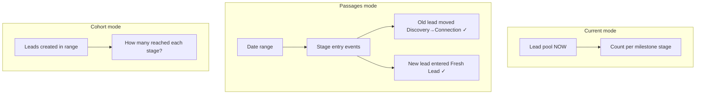

# CRM Insights — Complete Guide

**Last updated:** September 2026  
**UI route:** `/Insights`  
**Primary orchestrator:** `app/Components/Insights/InsightsClient.tsx`  
**API client:** `lib/crm-insights-api.ts`  
**Default date filter:** **This month** (`currentMonth` — current calendar month, auto-resets)

This document explains how the Insights page works end-to-end: filters, widgets, data sources (Hub vs frontend enrichment), and every API involved.

**Related docs (backend handoff / QA):**

| Doc | Purpose |
|-----|---------|
| [`CRM_INSIGHTS_BACKEND_HANDOFF.md`](./CRM_INSIGHTS_BACKEND_HANDOFF.md) | Hub Phase 1 contract, frozen scope rules |
| [`CRM_INSIGHTS_FILTER_ACCURACY_QA.md`](./CRM_INSIGHTS_FILTER_ACCURACY_QA.md) | Filter alignment QA checklist |
| [`CRM_INSIGHTS_LOST_FUNNEL_BACKEND_HANDOFF.md`](./CRM_INSIGHTS_LOST_FUNNEL_BACKEND_HANDOFF.md) | Lost funnel / drop reasons |
| [`CRM_INSIGHTS_HOLD_FUNNEL_BACKEND_HANDOFF.md`](./CRM_INSIGHTS_HOLD_FUNNEL_BACKEND_HANDOFF.md) | Hold funnel catalog |

---

## 1. What Insights is

Insights is the **sales analytics dashboard** for org leads (not presales / design). It answers:

- How many leads, meetings, bookings, and money in the selected scope?
- Where are leads stuck in the funnel (now, by movement, or by new-lead cohort)?
- Why are leads dropping? How fast do they move between stages?
- How is each salesperson performing vs targets and incentives?

All widgets share the **same three header filters** unless noted:

| Filter | Query param | Default |
|--------|-------------|---------|
| **Date** | `dateRange`, `dateFrom`, `dateTo` | **This month** |
| **Location** | `branchId` | All branches |
| **Sales people** | `salesManagerId` / `salesExecutiveId` | All (role-scoped) |

---

## 2. Who can access

| Role | Access | Filters |
|------|--------|---------|
| `SUPER_ADMIN`, `ADMIN`, `SALES_ADMIN` | Full Insights | Branch + full manager/executive hierarchy |
| `SALES_MANAGER`, `MANAGER` | Own team only | Team executives (no branch picker) |
| `SALES_EXECUTIVE` | **No access** | — |

**Super Admin only (WIP preview):**

- Sales Funnel modes **Passages** and **New leads (cohort)** — labeled *Under construction* but usable for preview.
- All other roles stay on **Current** funnel only.

Helpers: `canAccessCrmInsights()`, `canUseInsightsOrgFilters()`, `isSuperAdminRole()` in `lib/roleUtils.ts`.

---

## 3. Page layout (top → bottom)

```
┌─────────────────────────────────────────────────────────────┐
│ Header: Date · Branch · Sales people · Reset · Export (WIP) │
├─────────────────────────────────────────────────────────────┤
│ InsightsPerformanceCards — 4 sales KPI tiles                │
├─────────────────────────────────────────────────────────────┤
│ InsightSect2 — KPI strip (Total Leads, Lead→Meeting, etc.)  │
├─────────────────────────────────────────────────────────────┤
│ InsightSect3 — Sales Funnel (full width)                    │
├─────────────────────────────────────────────────────────────┤
│ InsightsSect4 — Drop reasons + Stage velocity               │
├─────────────────────────────────────────────────────────────┤
│ InsightsSect5 — Team performance matrix + incentives        │
├─────────────────────────────────────────────────────────────┤
│ InsightsSect6 — Leads over time, conversion trend, forecast │
└─────────────────────────────────────────────────────────────┘
```

| Section | Component | Primary data source |
|---------|-----------|---------------------|
| Performance cards | `InsightsPerformanceCards.tsx` | Hub `/performance-cards` + KPIs |
| KPI strip | `InsightSect2.tsx` | Hub dashboard KPIs + performance cards |
| Sales Funnel | `InsightsSect3.tsx` | FE-aligned inventory (**Current**) or Hub `/sales-funnel` (**Passages / Cohort**) |
| Drop + velocity | `InsightsSect4.tsx` | Hub dashboard + FE lost-segment alignment |
| Team matrix | `InsightsSect5.tsx` | Hub `teamPerformance` + FE incentives engine |
| Charts + forecast | `InsightsSect6.tsx` | Hub dashboard + FE week/month volume rebuild |

**Removed (Sep 2026):** Revenue Distribution sidebar — Sales Funnel now uses full card width.

---

## 4. Date filter — “This month” default

Defined in `lib/booking-token-date-filter.ts`:

```ts
export const DEFAULT_INSIGHTS_DATE_FILTER = { preset: "currentMonth" };
```

| Preset | `dateRange` sent to Hub | Meaning |
|--------|-------------------------|---------|
| **This month** | `current_month` (via performance-cards) / resolved ISO bounds | Current calendar month |
| All | `all` | No date cut |
| Last 3 / 6 months | `3m` / `6m` | Rolling window |
| Last 1 year | `1y` | Rolling window |
| Previous month | `previous_month` | Full prior calendar month |
| Custom | `custom` + `dateFrom` / `dateTo` | User-picked range |

**Hub rule:** Inclusive range in server timezone on lead **`createdAt`** unless a metric specifies otherwise (e.g. quotes sent uses `quoteSentAt`).

**Trend deltas** (`+12%`, etc.) = current period vs **previous equal-length period**.

---

## 5. Architecture — Hub vs frontend

```
Browser (InsightsClient)
    │
    ├── GET /api/crm/insights/dashboard          → Hub /v1/crm/insights/dashboard
    ├── GET /api/crm/insights/filter-options     → Hub /v1/crm/insights/filter-options
    ├── GET /api/crm/insights/performance-cards  → Hub /v1/crm/insights/performance-cards
    ├── GET /api/crm/insights/quotes-sent-month  → Hub /v1/crm/insights/quotes-sent-month
    └── GET /api/crm/insights/sales-funnel       → Hub /v1/crm/insights/sales-funnel
              │
              └── (Passages / Cohort only, Super Admin)

Frontend enrichment (parallel, for accuracy vs My Leads / Journey heatmap):
    ├── fetchAdminLeadsHeatmapData / fetchInsightsSalesManagerMyTeamLeads
    ├── insightsSalesManagerMilestoneAndTotal (id-merge stage inventory)
    ├── computeLostSegmentCounts / computeFunnelCurrentStageInvestmentTotals
    ├── fetchInsightsFunnelStagePathData (won/lost/hold substages)
    └── insights-team-incentive-matrix (Target / Achieved / Payoff)
```

**Why FE enrichment exists:** Sales Funnel **Current** mode must match **My Leads** journey counts (id-merge, verified inbox, assignee aliases). Hub dashboard funnel is a fallback; when FE pool loads, `alignedSalesFunnel` replaces Hub stages.

**Single scope rule (Hub P0):** One filter scope drives KPIs, funnels, drop, velocity, team matrix, and charts. Verify via `filtersApplied` in dashboard response.

---

## 6. API reference

All frontend calls go through Next.js BFF proxies under `/api/crm/insights/*`. Auth: `Authorization: Bearer <CRM JWT>` via `getCrmAuthHeaders()`.

### 6.1 Dashboard (main payload)

```http
GET /api/crm/insights/dashboard
  ?dateRange=all|3m|6m|1y|previous_month|custom|current_month
  &dateFrom=2026-09-01
  &dateTo=2026-09-30
  &branchId=HBR
  &salesManagerId=12
  &salesExecutiveId=45
  &teamPeriod=monthly
```

**Hub:** `GET /v1/crm/insights/dashboard`

**Returns (`InsightsDashboard`):**

| Block | Fields | Used in |
|-------|--------|---------|
| `filtersApplied` | Echo of active filters + `assigneeRule`, `branchField` | QA / debugging |
| `kpis` | `totalLeads`, `pipelineValue`, `closedWon`, `conversionPercent`, `tokenValue`, `bookingValue`, `grossBooking` | Sect2, performance cards |
| `salesFunnel` | Stage bars (fallback if FE alignment missing) | Sect3 Current |
| `lostFunnel` | Lost segment by stage | Sect3 Lost tab |
| `holdFunnel` | On Hold catalog stages | Sect3 Hold tab |
| `holdPathByStage` | Hold substages per milestone | Sect3 Hold + modal |
| `revenueDistribution` | Phases (legacy; UI removed Sep 2026) | — |
| `dropReasons` | Lost reasons list | Sect4 |
| `stageVelocity` | Avg days between stage hops | Sect4 |
| `teamPerformance` | Per-user leads/meetings/proposals/closed | Sect5 |
| `leadsOverTime` | Volume time series | Sect6 |
| `conversionTrend` | Conversion % over time | Sect6 |
| `revenueForecast` | target / actual / projected | Sect6 |

**People filter rules:**

| Send | Effect |
|------|--------|
| Neither | All (within role lock) |
| `salesManagerId` only | That manager’s **executive team** (manager’s own leads excluded from team KPIs) |
| `salesExecutiveId` only | Single executive |
| Both | Prefer executive; Hub **400** if exec ∉ manager team |

---

### 6.2 Filter options

```http
GET /api/crm/insights/filter-options?branchId=HBR
```

**Hub:** `GET /v1/crm/insights/filter-options`

**Returns:** `{ branches[], salesManagers[], salesExecutives[] }` for dropdowns.

---

### 6.3 Performance cards (4 KPI tiles)

```http
GET /api/crm/insights/performance-cards
  ?dateRange=current_month
  &branchId=HBR
  &salesManagerId=12
  &bookingTargetInr=30000000
  &leadToMeetingTargetPercent=75
  &meetingToBookingTargetPercent=40
```

**Hub:** `GET /v1/crm/insights/performance-cards`

**Note:** Omits `teamPeriod`. Sends `dateRange=current_month` when UI preset is “This month”.

**Cards:**

| Key | Shows |
|-----|-------|
| `bookingValue` | Booking ₹ vs monthly target |
| `weightedPipeline` | Weighted pipeline vs remaining target |
| `leadToMeeting` | Lead → Meeting conversion % |
| `meetingToBooking` | Meeting → Booking conversion % |

Each card includes `status` (`hit` / `on_track` / `at_risk` / `behind`), `tone`, and trend labels.

---

### 6.4 Quotes sent in period

```http
GET /api/crm/insights/quotes-sent-month
  ?dateFrom=2026-09-01&dateTo=2026-09-30
  &branchId=HBR
  &salesManagerId=12
```

**Hub:** `GET /v1/crm/insights/quotes-sent-month`

**Filter field:** `quoteSentAt` (not lead `createdAt`).

**Returns:**

```json
{
  "hubImplemented": true,
  "quotesSentCount": 45,
  "quotationValueInr": 28600000,
  "filterField": "quoteSentAt",
  "periodStart": "2026-09-01",
  "periodEnd": "2026-09-30",
  "pathBreakdownNow": { "won": 40, "lost": 3, "hold": 2 }
}
```

Used for funnel investment totals and performance card quotation metrics. If Hub returns **404**, BFF responds with zeros and `hubImplemented: false`.

---

### 6.5 Sales funnel (measure modes)

```http
GET /api/crm/insights/sales-funnel
  ?dateRange=custom&dateFrom=2026-09-01&dateTo=2026-09-30
  &branchId=HBR
  &salesManagerId=12
  &funnelMode=current|passages|cohort
  &pathFilter=all|won|lost|hold
```

**Hub:** `GET /v1/crm/insights/sales-funnel`

**Frontend rules:**

| `funnelMode` | When fetched | `pathFilter` sent |
|--------------|--------------|-------------------|
| `current` | Not via this API — uses FE-aligned inventory | N/A (UI tabs only) |
| `passages` | Super Admin selects Passages | **Never sent** — passages counts all entries |
| `cohort` | Super Admin selects Cohort | Sent (`all` / `won` / `lost` / `hold`) |

**Hub shipped (Sep 2026):** Passages returns `newCount`/`oldCount`/share % per stage, `conversion` block, Discovery-base %. Cohort returns live reach + `cohortProgress`. Timezone `Asia/Kolkata`. `Cache-Control: no-store`. When stage transition history is empty, Hub returns `501` with `passagesAvailable: false`. Frontend treats this as a valid “unavailable” state and shows an amber banner.

**Response shape (`InsightsSalesFunnelResponse`):**

```json
{
  "funnelMode": "passages",
  "pathFilter": "all",
  "passagesAvailable": true,
  "passagesUnavailableReason": null,
  "definitions": {
    "dateField": "stageEnteredAt",
    "reachRule": "...",
    "timezone": "Asia/Kolkata"
  },
  "total": { "count": 46, "sharePercent": 100, "countLabel": "Leads" },
  "stages": [
    {
      "stageKey": "discovery",
      "stageLabel": "Discovery",
      "count": 27,
      "sharePercent": 59,
      "pathBreakdown": { "won": 22, "lost": 4, "hold": 1 }
    }
  ]
}
```

---

### 6.6 Passages old-lead share trend (Passages tab only)

```http
GET /api/crm/insights/passages-trend
  ?months=12
  &branchId=HBR
  &salesManagerId=12
```

**Hub:** `GET /v1/crm/insights/passages-trend`

**Scope:** Branch + sales people only — **ignores** header date filter. Trailing 12 IST calendar months, oldest→newest.

**Formula per month:** `oldSharePercent = oldCount / (newCount + oldCount) * 100` (stage-entry sums, same new/old rules as Passages).

**UI:** Line chart inside Passages tab (`PassagesOldShareTrendChart.tsx`).

---

## 7. Sales Funnel — deep dive

The funnel has **two independent controls**:

1. **Measure mode** (camera) — *what* you count  
2. **Path filter** (tabs) — *which outcome path* (Current + Cohort only)

### 7.1 Measure modes

| Mode | Label | Question | Counts |
|------|-------|----------|--------|
| **Current** | Current | Who is **sitting in each stage right now**? | Snapshot inventory — same logic as Journey heatmap / My Leads phases |
| **Passages** | Passages (WIP) | Who **entered** each stage in the selected dates? | Stage **entries** — New/Old split by lead `createdAt` vs filter range |
| **Cohort** | Cohort (WIP) | Of leads **created** in the selected dates, how many **reached** each stage (live)? | Cohort from lead creation date; `cohortProgress` for in-progress vs final |



**Passages is NOT a mix of Current + Cohort.** It is purely **throughput / entries** in the period. Won/Lost/Hold path splits do **not** apply to Passages (tabs hidden, API omits `pathFilter`).

### 7.2 Path filters (Current + Cohort only)

| Tab | Shows |
|-----|-------|
| **All** | Full inventory + won/lost/hold badges per stage |
| **Won** | Won-path lead counts + share % |
| **Lost** | Lost-segment counts + drop % |
| **Hold** | Hub Hold catalog + hold substages |

Click a milestone bar (Current, All tab) to open **substage modal** (won / lost / hold breakdown).

### 7.3 Funnel stages (canonical order)

From `lib/insights-funnel-stage-paths.ts`:

1. **Total** (synthetic bar — sum row)  
2. Fresh Lead  
3. Discovery  
4. Connection  
5. Exp & Design  
6. Decision  
7. Closed  

Bar widths use a centered pyramid (`funnelPyramidWidthPercent`). Percent column meaning depends on mode/tab (conversion %, share %, or drop %).

### 7.4 Investment / ₹ on bars

For **Current** mode (All / Won tabs), each stage bar can show `count | ₹value`:

- FE computes `funnelStageValues` from lead budget maps + quote-sent scope (`insights-sales-funnel-investment.ts`).
- Values are **current-in-stage investment**, not Hub revenue distribution.

---

## 8. Other widgets

### 8.1 Drop reasons (Sect4)

- Hub `dropReasons` from dashboard.  
- FE may **reconcile** to `alignedLostFunnel.total` so reason counts sum exactly to Lost Funnel total.  
- Optional milestone filter uses same lost substages as funnel Lost path.

### 8.2 Stage velocity (Sect4)

Hub-only — mean days between completed transitions in filter window:

| Hop | Meaning |
|-----|---------|
| Discovery → Connection | Fresh/Discovery until Connection |
| Connection → Design Meeting | Until meeting scheduled |
| Design → Proposal | Until quote sent |
| Proposal → Closed Won | Until token/booking done |

Negative `trendDays` = faster than prior period (good).

### 8.3 Team matrix (Sect5)

| Column | Source |
|--------|--------|
| Leads, Meetings, Proposals, Closed, Conv % | Hub `teamPerformance` |
| Target, Achieved, Payoff | FE Incentives engine (`insights-team-incentive-matrix.ts`) |

`teamPeriod` is always **`monthly`** from FE. Payoff column hidden by flag but data still loads.

### 8.4 Charts + forecast (Sect6)

- **Leads over time** — FE `buildInsightsVolumeChartBundle`: weeks from date-scoped pool; **months from full inventory** (so trailing months aren’t empty when filter is “this month”).  
- **Conversion trend** — same FE week/month series (Closed ÷ created-in-bucket). Hub `conversionTrend` only if FE series missing.  
- **Revenue forecast** — Hub `revenueForecast`; Actual should align with `kpis.grossBooking` when `actualScope = grossBooking`.

Volume chart drill-down: month → week → day depending on date range length.

---

## 9. Frontend file map

| Path | Role |
|------|------|
| `app/Insights/page.tsx` | Route shell |
| `app/Components/Insights/InsightsClient.tsx` | State, fetches, FE alignment, layout |
| `app/Components/Insights/InsightsSect3.tsx` | Sales Funnel UI |
| `app/Components/Insights/InsightSect2.tsx` | KPI strip |
| `app/Components/Insights/InsightsPerformanceCards.tsx` | Top 4 tiles |
| `app/Components/Insights/InsightsSect4.tsx` | Drop + velocity |
| `app/Components/Insights/InsightsSect5.tsx` | Team matrix |
| `app/Components/Insights/InsightsSect6.tsx` | Charts + forecast |
| `lib/crm-insights-api.ts` | Types, normalizers, fetch helpers |
| `lib/insights-funnel-stage-paths.ts` | Stage keys, path breakdown, alignment |
| `lib/insights-sales-funnel-investment.ts` | ₹ per funnel stage |
| `lib/insights-sm-journey-align.ts` | SM/admin pool + milestone totals |
| `lib/insights-week-charts.ts` | Volume chart rebuild |
| `lib/insights-team-incentive-matrix.ts` | Target / Achieved / Payoff |
| `lib/insights-quotes-sent-month.ts` | Quotes-sent metrics helper |
| `app/api/crm/insights/*/route.ts` | BFF proxies to Hub |

---

## 10. Work shipped — September 2026

| Item | Status |
|------|--------|
| Insights scroll shell (viewport-locked, internal scroller, custom thumb) | ✅ |
| Slim auto-hide scrollbar (`globals.css` + `insights-lock-scroll`) | ✅ |
| Sales Funnel Hub API wiring (`/sales-funnel`, modes + pathFilter) | ✅ |
| Funnel mode switcher: Current / Passages / Cohort | ✅ |
| Passages New/Old split + Discovery→Closed summary | ✅ (Hub + FE) |
| Passages old-lead share trend chart (12 months) | ✅ |
| Hub backend: sales-funnel + passages-trend | ✅ (Sep 2026) |
| Super Admin gating + WIP / Under construction banners | ✅ |
| Revenue Distribution panel removed; funnel full width | ✅ |
| Passages: hide Won/Lost/Hold tabs + badges; force `pathFilter=all` | ✅ |
| Default date = **This month** | ✅ (existing) |

**Still WIP / preview (UI only):**

- Passages & Cohort modes visible to **Super Admin only** (product launch gating)  
- Export PDF button (disabled in UI)  
- Passages shows `501` amber banner when stage history empty for scope

**Backend reference:** [`CRM_INSIGHTS_SALES_FUNNEL_PASSAGES_COHORT_BACKEND_HANDOFF.md`](./CRM_INSIGHTS_SALES_FUNNEL_PASSAGES_COHORT_BACKEND_HANDOFF.md)

---

## 11. Quick tester checklist

1. Open `/Insights` — default date should be **This month**.  
2. Network tab — confirm `filtersApplied` matches header filters.  
3. **Current** funnel counts should match My Leads journey phases for same scope.  
4. Switch to **Passages** (Super Admin) — no Won/Lost/Hold tabs; counts = stage entries in range.  
5. Switch to **Cohort** — live cohort reach; path tabs work; check `cohortProgress`.  
6. Passages tab — verify old-lead trend chart (12 months) updates on people/branch change only.  
7. Change branch / manager / executive — all sections update together.  
8. Sales Manager login — no branch filter; sees own team only.

---

## 12. Example requests (This month, all branches)

```bash
# Dashboard
GET /api/crm/insights/dashboard?dateRange=current_month&teamPeriod=monthly

# Performance cards
GET /api/crm/insights/performance-cards?dateRange=current_month

# Quotes sent MTD
GET /api/crm/insights/quotes-sent-month?dateRange=current_month

# Passages funnel (Super Admin)
GET /api/crm/insights/sales-funnel?dateRange=current_month&funnelMode=passages

# Cohort funnel with Won path
GET /api/crm/insights/sales-funnel?dateRange=current_month&funnelMode=cohort&pathFilter=won

# Passages old-lead share trend (scope only)
GET /api/crm/insights/passages-trend?months=12&branchId=HBR
```

---

## 13. Glossary

| Term | Meaning |
|------|---------|
| **Scope** | Combined date + branch + people filter applied to all widgets |
| **Id-merge pool** | Lead rows deduped by journey identity (matches My Leads heatmap) |
| **Current-in-stage** | A lead counted in the milestone where it sits now, not cumulative roll-up |
| **Lost segment** | Leads on lost path, counted by last milestone before drop |
| **Passages** | Stage entry events in date range (movement throughput) |
| **Cohort** | Leads created in date range, measured by stages reached |
| **Path filter** | All / Won / Lost / Hold outcome split (not used for Passages) |
